# PILOT

**PILOT: A Promptable Interleaved Layout-aware OCR Transformer**

[](https://arxiv.org/pdf/2504.03621v2)
[](#citation)

PILOT is an end-to-end OCR model that generates text and layout tokens in a single sequence.  
It supports four prompt-driven tasks:

- `<ocr>`: read the full text only
- `<ocr_with_boxes>`: read the full text and predict word/line boxes
- `<find_it> text`: locate a query string in the image
- `<ocr_on_box> <x_i><y_j><x_k><y_l>`: read only a target region

This repository provides inference code, released checkpoints, configs, tokenizer files, and sample inputs/outputs.

## Highlights

- Single model family for OCR, OCR with localization, spotting, and region-conditioned OCR
- Simple command-line inference
- Released generic and specialized checkpoints
- Lightweight CNN encoder + mBART decoder
- Prompt-based interface consistent with the paper

## Paper

**PILOT: A Promptable Interleaved Layout-aware OCR Transformer**  
Accepted at **IJDAR**.

- Paper: [arXiv:2504.03621](https://arxiv.org/pdf/2504.03621v2)

## Repository structure

```text
PILOT/
├── pilot/
│   ├── __init__.py
│   ├── modeling.py
│   └── models/
│       ├── __init__.py
│       ├── encoder.py
│       └── decoder.py
├── checkpoints/
│   ├── pilot_generic.safetensors
│   ├── pilot_iam.safetensors
│   ├── pilot_iam_spotting.safetensors
│   ├── pilot_rimes.safetensors
│   ├── pilot_sroie.safetensors
│   └── tokenizer/
├── configs/
│   ├── pilot_generic.json
│   ├── pilot_iam.json
│   ├── pilot_iam_spotting.json
│   ├── pilot_rimes.json
│   └── pilot_sroie.json
├── input_samples/
├── outputs/
├── run_pilot.py
└── README.md
```

## Installation

Create an environment and install the main dependencies:

```bash
pip install torch torchvision transformers safetensors pillow numpy
```

Then clone the repository and place the released checkpoints inside `checkpoints/`.

## Released checkpoints

The repository contains one generic model and several dataset-specialized checkpoints.

### Generic checkpoint

- `pilot_generic`
  - intended use: multi-task inference
  - supported tasks: `<ocr>`, `<ocr_with_boxes>`, `<find_it>`, `<ocr_on_box>`

### Specialized checkpoints

- `pilot_iam`
  - dataset: IAM
  - supported tasks: `<ocr_with_boxes>`

- `pilot_iam_spotting`
  - dataset: IAM
  - supported tasks: `<find_it>`

- `pilot_rimes`
  - dataset: RIMES
  - supported tasks: `<ocr_with_boxes>`

- `pilot_sroie`
  - dataset: SROIE
  - supported tasks: `<ocr_with_boxes>`

Each config file defines the correct preprocessing statistics, coordinate bin size, and decoder maximum length for its checkpoint.

## Weights

Model weights are hosted on **Zenodo**.

- Zenodo DOI: [10.5281/zenodo.19681701](https://doi.org/10.5281/zenodo.19681701)

After download, place the files in `checkpoints/` or update the paths in the config files.

## Quick start

### Generic OCR with boxes

```bash
python run_pilot.py --config configs/pilot_generic.json --image input_samples/other1.png --task ocr_with_boxes
```

### IAM spotting

```bash
python run_pilot.py --config configs/pilot_iam_spotting.json --image input_samples/iam-spotting.png --task find_it --query "accidentally"
```

### RIMES OCR with boxes

```bash
python run_pilot.py --config configs/pilot_rimes.json --image input_samples/rimes.png --task ocr_with_boxes
```

### SROIE OCR with boxes

```bash
python run_pilot.py --config configs/pilot_sroie.json --image input_samples/sroie.jpg --task ocr_with_boxes
```

### IAM OCR with boxes

```bash
python run_pilot.py --config configs/pilot_iam.json --image input_samples/iam.png --task ocr_with_boxes
```

### Region-conditioned OCR

```bash
python run_pilot.py --config configs/pilot_generic.json --image input_samples/focus_en_bench.png --task ocr_on_box --box 50 836 737 851
```

## Command-line interface

```bash
python run_pilot.py \
  --config configs/pilot_generic.json \
  --image path/to/image.png \
  --task ocr_with_boxes
```

Main arguments:

- `--config`: path to a model config JSON file
- `--image`: input image path
- `--task`: one of `ocr`, `ocr_with_boxes`, `find_it`, `ocr_on_box`
- `--query`: query string for `find_it`
- `--box X1 Y1 X2 Y2`: input box for `ocr_on_box`
- `--output-dir`: directory for predictions and visualizations
- `--num-beams`: beam size for generation
- `--cpu`: force CPU inference

## Examples

### 1. Generic model on a mixed document sample

**Command**
```bash
python run_pilot.py --config configs/pilot_generic.json --image input_samples/other1.png --task ocr_with_boxes
```

<table>
  <tr>
    <td align="center"><b>Input</b></td>
    <td align="center"><b>Prediction</b></td>
  </tr>
  <tr>
    <td>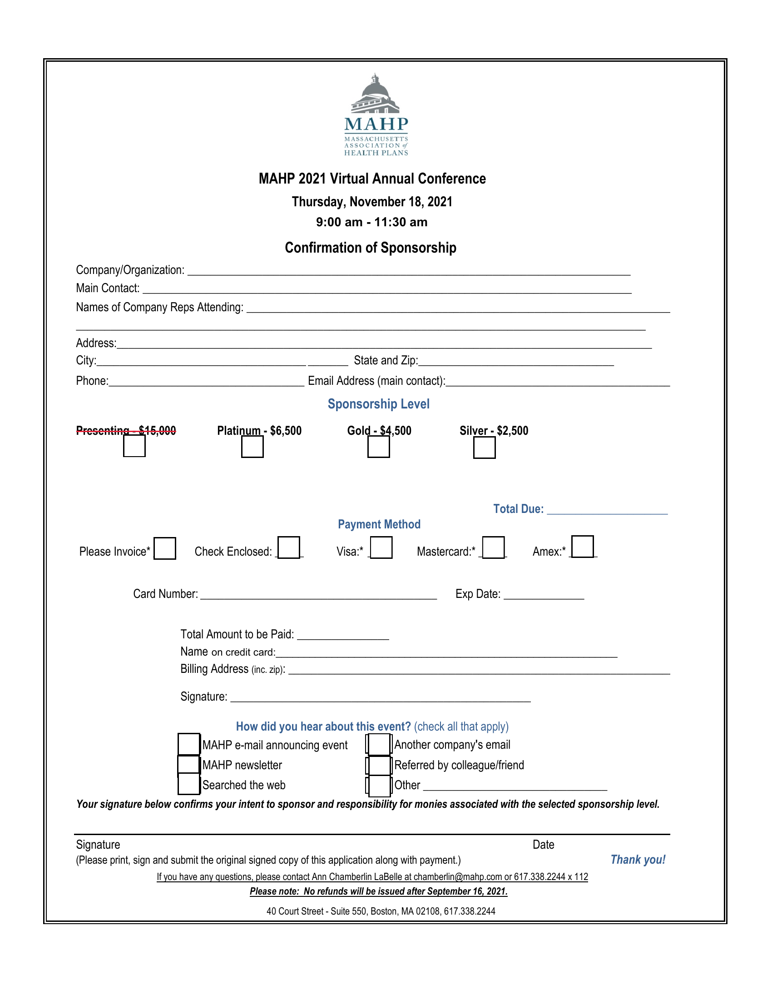</td>
    <td>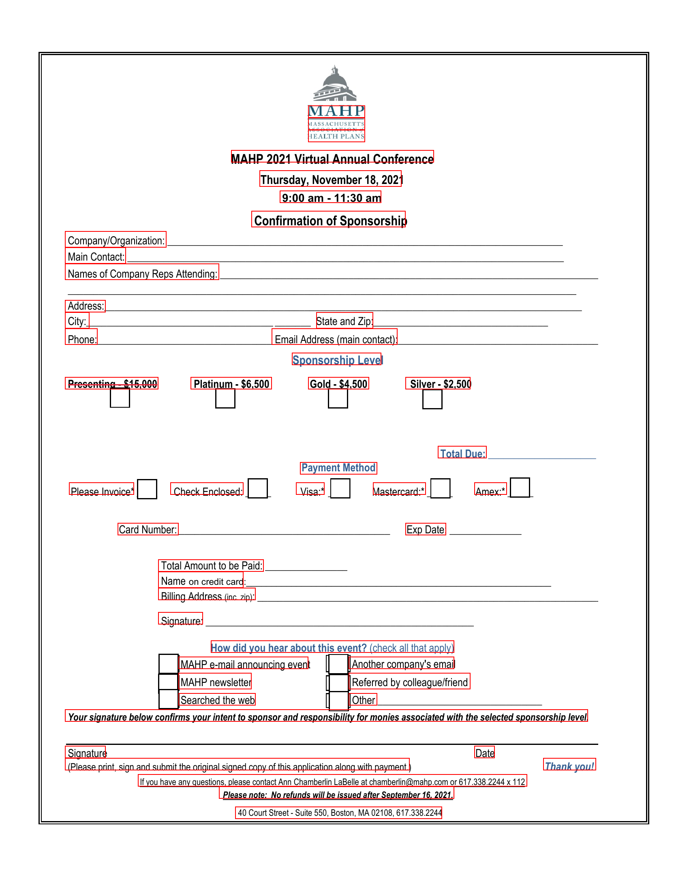</td>
  </tr>
</table>

<details>
  <summary><b>Recognized text</b></summary>

```text
MAHP
MASSACHUSETTS
HEALTH PLANS
MAHP 2021 Virtual Conference
Thursday, November 18, 2021
9:00 am - 11:30 am
Confirmation of Sponsorship
Company/Organization:
Main Contact:
Names of Company Reps Attending:
Address:
State and Zip:
City:
Phone:
Email Address (main contact):
Sponsorship Level
Presenting $15,000
Platinum - $6,500
Gold - $4,500
Silver - $2,500
Payment Method
Total Due:
Visa:*
Mastercard:*
Amex:*
Please Invoice*
Check Enclosed:
Visa:*
Exp Date:
Card Number:
Total Amount to be Paid:
Name on credit card:
Billing Address (inc. zip):
Signature:
How did you hear about this event? (check all that apply)
MAHP e-mail announcing event
Another company's email
MAHP newsletter
Referred by colleague/friend
Searched the web
Other
Your signature below confirms your intent to sponsor and responsibility for monies associated with the selected sponsorship level.
Signature
Date
(Please print, sign and submit the original signed copy of this application along with payment.)
Thank you!
If you have any questions, please contact Ann Chamberlin Labelle at chamberlin@mahp.com or 617.338.2244 x 112
Please note: No refunds will be issued after September 16, 2021.
40 Court Street - Suite 550, Boston, MA 02108, 617.338.2244
```

</details>

Generated files:

- `outputs/other1_ocr_with_boxes_raw.txt`
- `outputs/other1_ocr_with_boxes.txt`
- `outputs/other1_ocr_with_boxes.json`
- `outputs/other1_ocr_with_boxes_boxes.png`

### 2. IAM handwriting OCR with boxes

**Command**
```bash
python run_pilot.py --config configs/pilot_iam.json --image input_samples/iam.png --task ocr_with_boxes
```

<table>
  <tr>
    <td align="center"><b>Input</b></td>
    <td align="center"><b>Prediction</b></td>
  </tr>
  <tr>
    <td>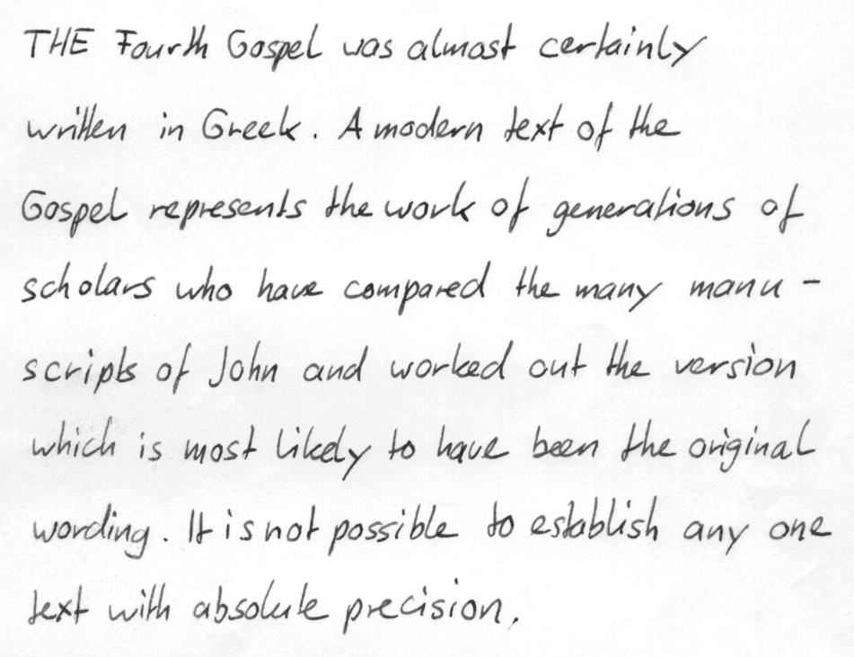</td>
    <td>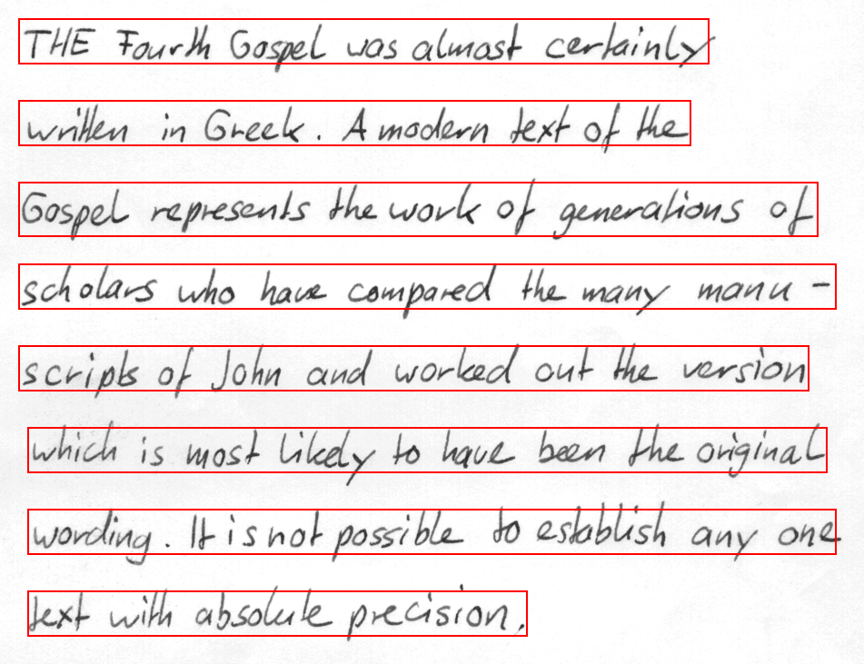</td>
  </tr>
</table>

<details>
  <summary><b>Recognized text</b></summary>

```text
THE Fourth Gospel was almost certainly
written in Greek. A modern text of the
Gospel represents the work of generations of
scholars who have compared the many many manu-
scripts of John and worked out the version
which is most likely to have been the original
wording. It is not possible to establish any one
text with absolute precision.
```

</details>

Generated files:

- `outputs/iam_ocr_with_boxes_raw.txt`
- `outputs/iam_ocr_with_boxes.txt`
- `outputs/iam_ocr_with_boxes.json`
- `outputs/iam_ocr_with_boxes_boxes.png`

### 3. IAM spotting with `<find_it>`

**Command**
```bash
python run_pilot.py --config configs/pilot_iam_spotting.json --image input_samples/iam-spotting.png --task find_it --query "accidentally"
```

<table>
  <tr>
    <td align="center"><b>Input</b></td>
    <td align="center"><b>Prediction</b></td>
  </tr>
  <tr>
    <td>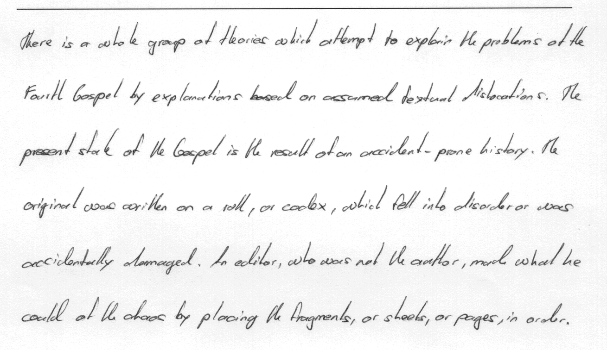</td>
    <td>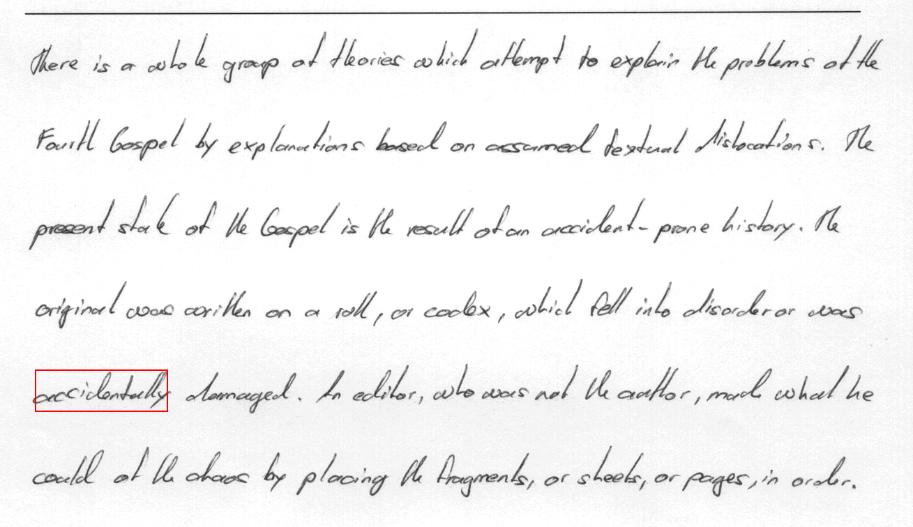</td>
  </tr>
</table>

Generated files:

- `outputs/iam-spotting_find_it_raw.txt`
- `outputs/iam-spotting_find_it.json`
- `outputs/iam-spotting_find_it_boxes.png`

### 4. RIMES OCR with boxes

**Command**
```bash
python run_pilot.py --config configs/pilot_rimes.json --image input_samples/rimes.png --task ocr_with_boxes
```

<table>
  <tr>
    <td align="center"><b>Input</b></td>
    <td align="center"><b>Prediction</b></td>
  </tr>
  <tr>
    <td>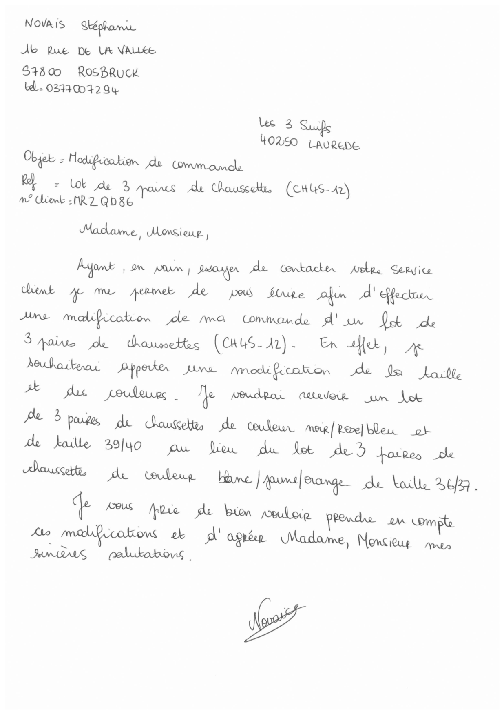</td>
    <td>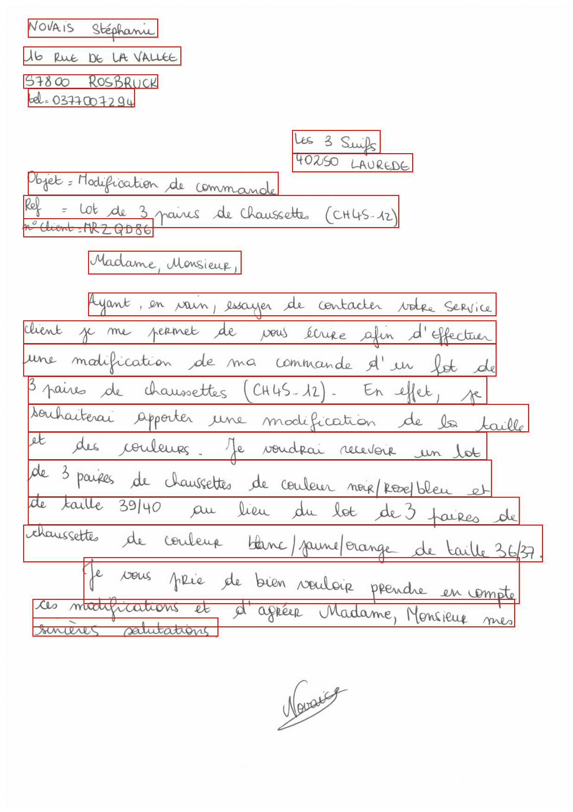</td>
  </tr>
</table>

<details>
  <summary><b>Recognized text</b></summary>

```text
NOVAIS Stépanie
16 RUE DE LA VALLEE
57800 ROSBRUCK
tel : 03770072994
Les 3 Suifs
40250 LAUREDE
Objet : Modification de commande
Ref : Lot de 3 paires de chaussettes (CH45-12)
n° Client : MZZQD86
Madame, Monsieur,
Ayant, en vain, essayer de contacter votre service
client je me permet de vous écrire afin d'effectuer
une modification de ma commande d'un lot de
3 paires de chaussettes (CH45-12). En effet, je
souhaiterai apporter une modification de la taille
et des couleurs. Je voudrai recevoir un lot
de 3 paires de chaussettes de couleur noir (re)ble et
de taille 39140 au lieu du lot de 3 paires de
chaussettes de couleur blanc/same/orange de taille 36/37.
Je vous prie de bien vouloir prendre en compte
ces modifications et d'agréer Madame, Monsieur mes
sincères salutations.
```

</details>

Generated files:

- `outputs/rimes_ocr_with_boxes_raw.txt`
- `outputs/rimes_ocr_with_boxes.txt`
- `outputs/rimes_ocr_with_boxes.json`
- `outputs/rimes_ocr_with_boxes_boxes.png`

### 5. SROIE OCR with boxes

**Command**
```bash
python run_pilot.py --config configs/pilot_sroie.json --image input_samples/sroie.jpg --task ocr_with_boxes
```

<table>
  <tr>
    <td align="center"><b>Input</b></td>
    <td align="center"><b>Prediction</b></td>
  </tr>
  <tr>
    <td>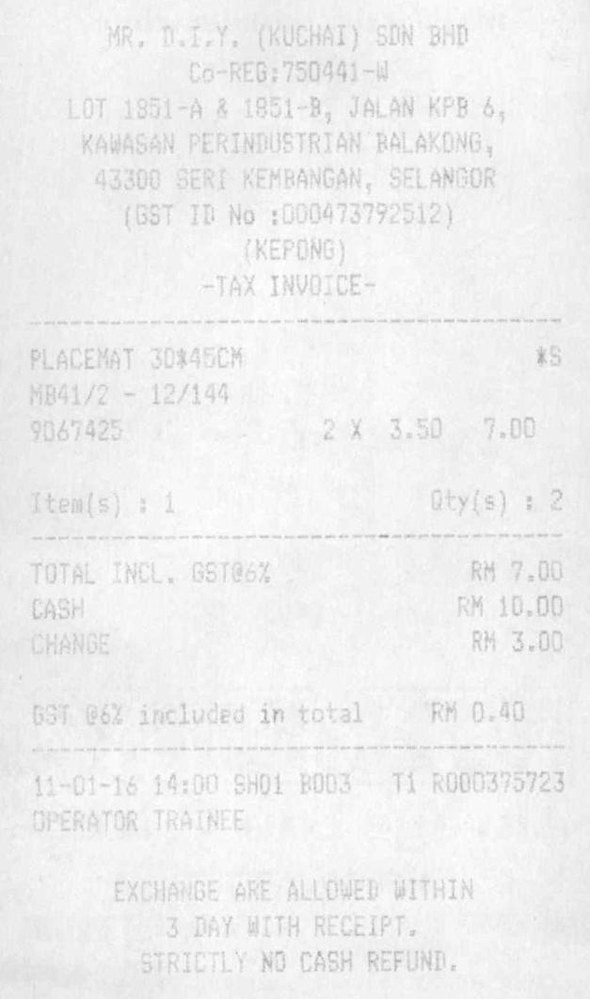</td>
    <td>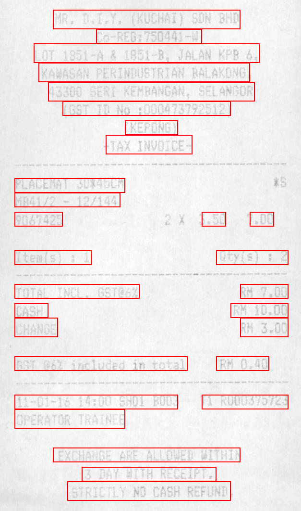</td>
  </tr>
</table>

<details>
  <summary><b>Recognized text</b></summary>

```text
MR. D.I.Y. (KUCHAI) SDN BHD
CO-REG:750441-W
LOT 1851-A & 1851-B, JALAN KPB 6,
KAWASAN PERINDUSTRIAN BALAKONG,
43300 SERI KEMBANGAN, SELANGOR
(GST ID NO :000473792512)
(KEPONG)
-TAX INVOICE-
PLACEMAT 30*45CM
MB41/2 - 12/144
9067425
ITEM(S) : 1
TOTAL INCL. GST@6%
CASH
CHANGE
GST @6% INCLUDED IN TOTAL
QTY(S) : 2
RM 7.00
RM 10.00
RM 3.00
RM 0.40
11-01-16 14:00 SH01 B003
OPERATOR TRAINEE
EXCHANGE ARE ALLOWED WITHIN
3 DAY WITH RECEIPT.
STRICTLY NO CASH REFUND.
3.50
T1 R000375723
T1 R000375723
RM 0.40
EXCHANGE ARE ALLOWED WITHIN
3 DAY WITH RECEIPT.
STRICTLY NO CASH REFUND.
3.50
7.00
QTY(S) : 2
-TAX INVOICE-
```

</details>

Generated files:

- `outputs/sroie_ocr_with_boxes_raw.txt`
- `outputs/sroie_ocr_with_boxes.txt`
- `outputs/sroie_ocr_with_boxes.json`
- `outputs/sroie_ocr_with_boxes_boxes.png`

### 6. Region-conditioned OCR with `<ocr_on_box>`

**Command**
```bash
python run_pilot.py --config configs/pilot_generic.json --image input_samples/focus_en_bench.png --task ocr_on_box --box 50 836 737 851
```

<table>
  <tr>
    <td align="center"><b>Input</b></td>
    <td align="center"><b>Selected region</b></td>
  </tr>
  <tr>
    <td></td>
    <td>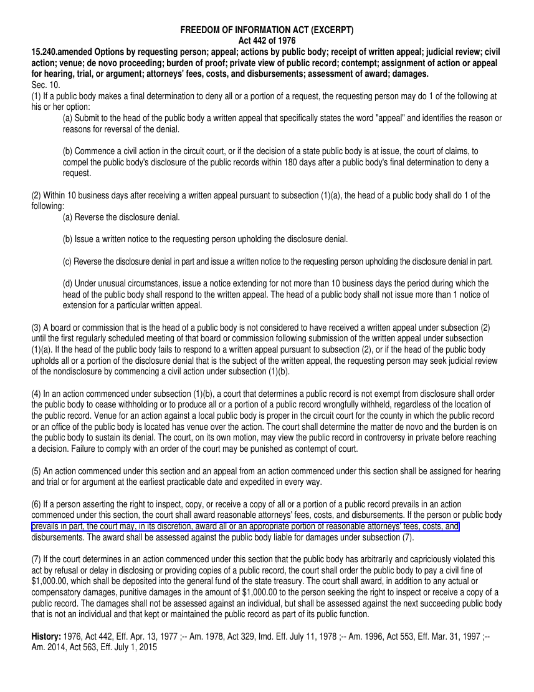</td>
  </tr>
</table>

<details>
  <summary><b>Recognized text</b></summary>

```text
prevais in art. He courman in asserton, award a la on a propriete portion of resonable atomers. He person or public public public.
```

</details>

Generated files:

- `outputs/focus_en_bench_ocr_on_box_raw.txt`
- `outputs/focus_en_bench_ocr_on_box.txt`
- `outputs/focus_en_bench_ocr_on_box.json`
- `outputs/focus_en_bench_ocr_on_box_input_box.png`

This task reads only the content inside the user-provided box.

## Output files

For each inference call, `run_pilot.py` writes:

- `*_raw.txt`: raw generated sequence with prompt and coordinate tokens
- `*.txt`: cleaned text output when applicable
- `*.json`: summary containing prompt, runtime, raw output, cleaned text, and predicted boxes
- `*_boxes.png`: visualization of predicted boxes when applicable

## Supported prompts

### Full-page OCR only

```text
<ocr>
```

### Full-page OCR with boxes

```text
<ocr_with_boxes>
```

### Query-by-string spotting

```text
<find_it> accidentally
```

### OCR inside a user-provided box

```text
<ocr_on_box> <x_20><y_30><x_120><y_70>
```

Coordinates are quantized according to the `coord_bin_size` defined in the selected config.

## Notes

- Use the config that matches the released checkpoint.
- The specialized checkpoints are not intended to support every prompt.
- Preprocessing mean/std values differ across checkpoints.
- The generic model is the recommended starting point if you want to explore all tasks.

## Citation

If you use this repository, please cite the paper:

```bibtex
@article{hamdi2026pilot,
  title   = {PILOT: A Promptable Interleaved Layout-aware OCR Transformer},
  author  = {Laziz Hamdi, Amine Tamasna, Pascal Boisson and Thierry Paquet},
  journal = {International Journal on Document Analysis and Recognition},
  year    = {2026},
  note    = {Accepted for publication}
}
```

## Acknowledgements

This repository releases the inference code and checkpoints corresponding to the PILOT paper.  
The Zenodo archive is the reference source for the published model weights.
